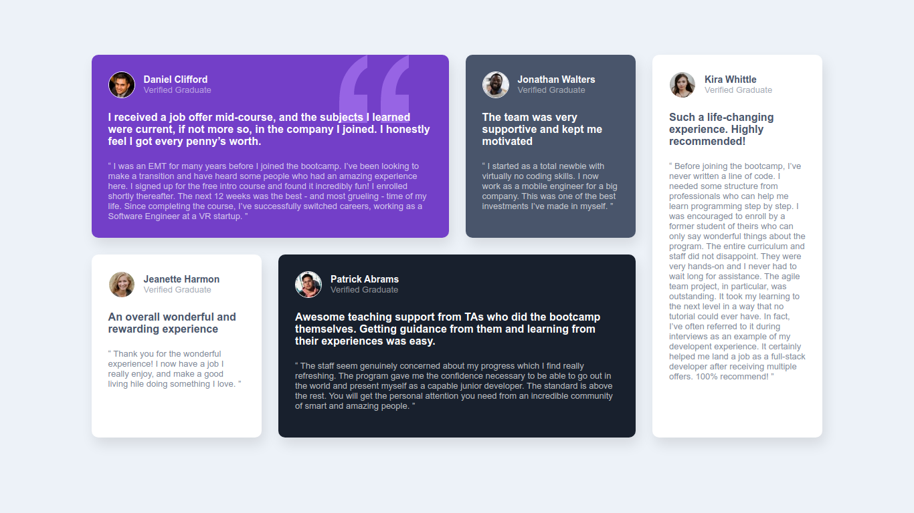
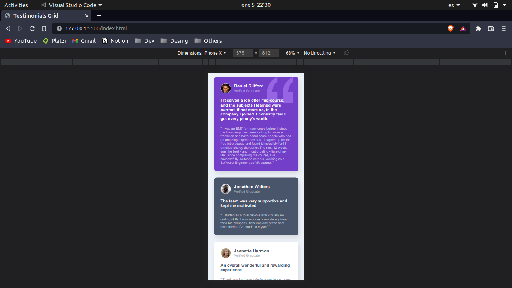

# Testimonials-grid

This is a solution to the [Testimonials grid section challenge on Frontend Mentor](https://www.frontendmentor.io/challenges/testimonials-grid-section-Nnw6J7Un7). Frontend Mentor challenges help you improve your coding skills by building realistic projects. 

## Table of contents

- [Overview](#overview)
  - [The challenge](#the-challenge)
  - [Screenshot](#screenshot)
  - [Links](#links)
- [My process](#my-process)
  - [Built with](#built-with)
  - [What I learned](#what-i-learned)
  - [Continued development](#continued-development)
- [Author](#author)

## Overview

### The challenge

Users should be able to:

- View the optimal layout for the site depending on their device's screen size

### Screenshot

### Links

- [Solution URL](https://your-solution-url.com)
- [Live Site URL](https://your-live-site-url.com)

## My process

### Built with

- Semantic HTML5 markup
- CSS custom properties
- CSS Grid
- Mobile-first workflow

### What I learned

I learn to use a semantic HTML, it is fundamental for SEO and more, I improved my skills in CSS, how to use specificity and not block me when it doesn't happen the way I want

### Continued development

I will use this junior challenge to improve my Web skills using other technologies like APIs and React

## Author

- GitHub -> [Kevin-Curruchich](https://github.com/Kevin-Curruchich)
- Frontend Mentor -> [@Kevin-Curruchich](https://www.frontendmentor.io/profile/Kevin-Curruchich)
- Twitter -> [@Chiwy_6](https://www.twitter.com/Chiwy_6)
